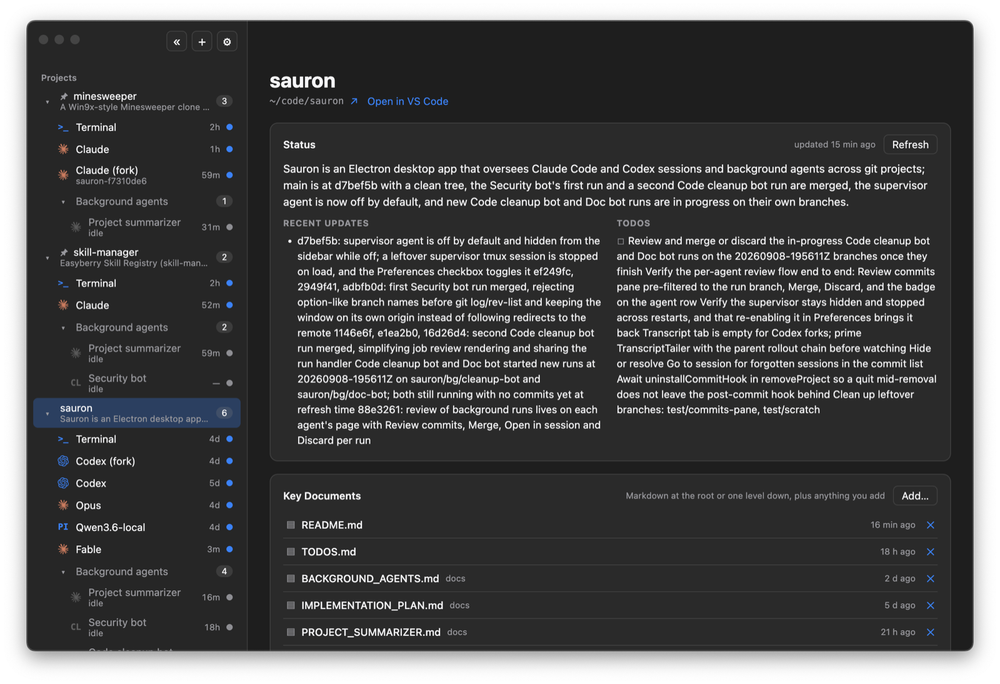
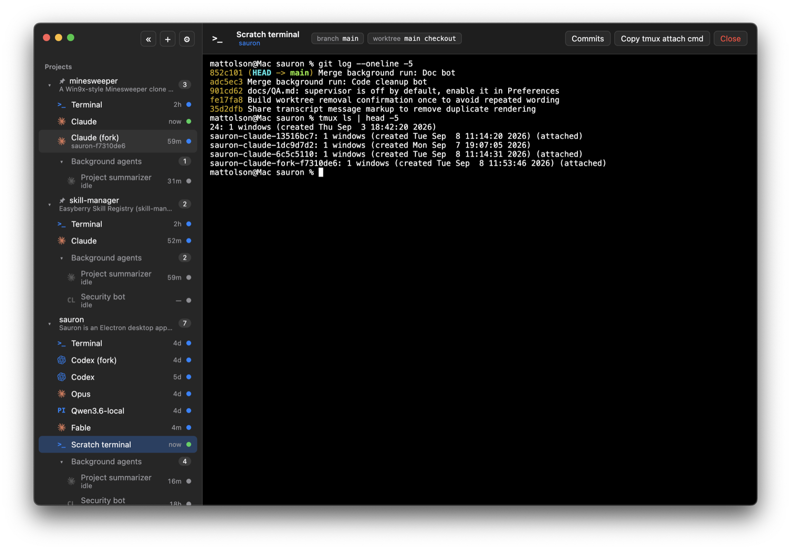
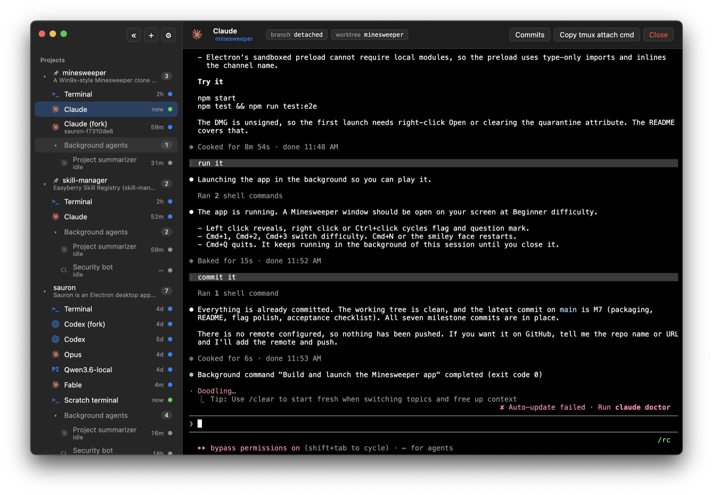
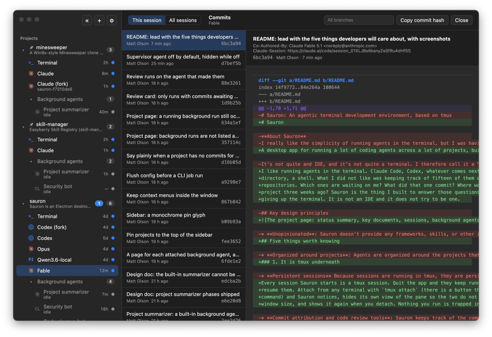

# Sauron


A "terminal development environment" for running a lot of coding agents across a lot of projects, built on tmux.

<br clear="all">

I like running agents in the terminal. Claude Code, Codex, Opencode, Picode, local AI, cloud providers, etc. What I do not like is keeping track of fifteen of them across six
repositories. What did that one agent commit? Where was I on this
project three weeks ago? Sauron is the thing I built to answer those questions without
giving up the terminal. It is not quite an IDE and it is not quite a terminal. I call it a TDE (terminal development environment).

It is free and open source and always will be!

**Download:** [Sauron-0.1.0-arm64.dmg](https://github.com/mlolson/sauron/releases/latest/download/Sauron-0.1.0-arm64.dmg)
for Apple silicon Macs on macOS 15 or later, signed and notarized. Other builds are on the
[releases page](https://github.com/mlolson/sauron/releases). It needs `tmux`, `git`, and at least
one agent CLI such as `claude` or `codex` on your PATH.



## Six key points

### 1. It is tmux underneath

Every session Sauron starts is a tmux session. Quit the app and they keep running. Reboot and
resume them. Attach from any terminal with `tmux attach` (there is a button that copies the
command). Nothing you run is trapped inside the app. Sauron can also see sessions that are started in external terminal. The principal is low coupling between Sauron and your tmux sessions. 



### 2. It is unopinionated

Sauron does not include skills, a task framework, a planning routine, or instructions for your
agents. It does not put anything in your repository except a `post-commit` hook, an entry in
`.git/info/exclude`, and the ignored `.sauron/` directory that entry covers. An agent is a profile: an executable and its arguments. Claude and
Codex come preconfigured; add anything else that runs in a terminal, including a plain shell.
Run agents the way you already do, with the flags you already use. Sauron just keeps track of them.

### 3. Designed to avoid vendor lock-in

Run Claude, Codex, Openrouter, and a local model side by side under the same project. Fork a session into
a worktree. Hand a session's work to a *different* agent:
Sauron writes a briefing from the recent transcript, the session's commits, and the state of
the working tree, and starts the other agent with it. No model in the loop, so it takes a
fraction of a second. Hit a usage limit on one vendor, carry on with another.

### 4. Background agents whose output you review

Sauron allows you to define "background" agents and attach them to any project. Background agetns
run headless in a fresh worktree on its own branch, manually, on a schedule, or after commits
with a cooldown, and it runs whether or not the app is open. When it finishes, its commits
wait on the agent's page with a diff viewer and Merge. Or they can run on your main repo and just do whatever.



### 5. Every commit knows which session made it

A `post-commit` hook records which session was behind each commit, so an agent's work is
never just "Matt Olson, 4d ago" in the log. Each session shows its last commit under its name
in the sidebar. The Commits pane lists everything a session committed, with the diff, or
switches to the whole project so you can see who did what across every agent and branch.
It works for you too: commits you make by hand inside a Sauron terminal are attributed to that
terminal. The hook only ever exits 0, so it cannot break a commit.



### 6. 100% Free and Open Source

No paid tier, no subscription, no credit card. Free to use and modify as you wish.

## Also in the box

- **Project summaries.** A built-in background agent rewrites a short status for each project
  after commits: what it is, what changed, what is open or blocked. It lives in
  `<project>/.sauron/status.json`, kept out of git, where your other agents can read it too.
- **Sessions you started elsewhere.** Claude and Codex sessions launched from a terminal show
  up under their project with a live transcript. Import one to bring it under Sauron.
- **Worktrees.** Start a session in a fresh worktree on its own branch so parallel agents do
  not step on each other. The header shows the branch and checkout and updates as they change.
- **A supervisor agent**, off by default. A long-lived agent you chat with that can start and
  message workers through the CLI.

## Stack

Electron, TypeScript, React, xterm.js, node-pty, built with electron-vite. Sessions run
inside tmux; commit attribution lives in a SQLite database alongside the app's config.

## Building and running

Requires Node 22+, pnpm, and on the machine: `tmux`, `git`, `claude` (Codex optional).

```sh
pnpm install          # also rebuilds node-pty for Electron
pnpm dev              # hot-reloading development run
scripts/app.sh             # build and launch the unpackaged dev build, detached
scripts/app.sh --packaged  # build and launch dist/mac-arm64/Sauron.app (proper name and icon; slower)
scripts/install-launcher.sh  # installs `sauron-dev` on PATH and ~/Desktop/Sauron.app, both of which run scripts/app.sh
pnpm test             # Vitest
pnpm typecheck
pnpm package          # unsigned Sauron.app in dist/
```

## Distributing

`pnpm dist` builds a signed, notarized DMG (and zip) into `dist/`. It needs two things set up
once on the machine that builds:

1. A **Developer ID Application** certificate in the login keychain, from Xcode > Settings >
   Accounts > Manage Certificates, or from developer.apple.com.
2. Notarization credentials stored as a keychain profile named `sauron-notary`:
   ```sh
   xcrun notarytool store-credentials sauron-notary --apple-id you@example.com --team-id TEAMID
   ```
   It asks for an app-specific password, made at appleid.apple.com.

The script refuses to run without both. `scripts/dist.sh --unsigned` builds the same DMG
unsigned for a local check; other Macs will only open that one via right-click > Open.
Signing uses the hardened runtime with the entitlements in `build/entitlements.mac.plist`
(JIT and unsigned executable memory for Electron, library validation off for node-pty).

## Using it

- **⌘O** add a project, **⌘,** preferences, **⌘K** quick switcher, **⌘⇧]** / **⌘⇧[** next and
  previous live session. Right-click projects, sessions, and the supervisor for actions.
- Add a project by dragging a git repository onto the window, pressing ⌘O, or from the shell:
  `open -a Sauron ~/code/my-repo` (packaged app) or `scripts/sauron projects add ~/code/my-repo`.
- The supervisor's home is `~/Library/Application Support/Sauron/master`; Sauron writes both
  `CLAUDE.md` and `AGENTS.md` there so agents of either convention receive its instructions.
- Logs: `~/Library/Logs/Sauron/main.log` (Preferences > Reveal Logs).
- `docs/QA.md` is the manual checklist; `scripts/smoke.sh` is the end-to-end check against a
  running app. `TODOS.md` tracks open items.

## The `sauron` CLI

`scripts/sauron` talks to the running app over `~/Library/Application Support/Sauron/sauron.sock`.
The supervisor agent uses the same commands to drive workers.

```sh
scripts/sauron ping
scripts/sauron projects [add <dir>]
scripts/sauron sessions [--project <name|id>]
scripts/sauron launch --project <name|id> [--tool claude|codex|shell|<profile>] [--prompt "..."] [--worktree [<branch>]]
scripts/sauron send --session <id> --text "..."
scripts/sauron stop | resume | close | hide --session <id>
scripts/sauron fork --session <id>
scripts/sauron handoff --session <id> --tool <profile>
scripts/sauron rename --session <id> --title "..."
scripts/sauron worktrees --project <name|id> [remove --path <dir> [--force]]
scripts/sauron status refresh --project <name|id>   # run the Project summarizer now
scripts/sauron status set --project <name|id> --summary "..." [--details "..."] [--update "..."] [--todo "..."]
scripts/sauron status get|set ...                # also work with the app closed, straight from the project's status file
scripts/sauron job run|list|merge|discard ...    # background agent runs; `sauron tick` is what launchd calls every minute
scripts/sauron master                            # start the supervisor
scripts/sauron select --project <name|id> [--job <agent id>] | --session <id> | --document <path>
```

Set `SAURON_TOOL_CLAUDE`, `SAURON_TOOL_CODEX`, `SAURON_TOOL_TMUX`, or `SAURON_TOOL_GIT` to override
a tool's path; the value `none` simulates a missing tool.

## Agent profiles

Preferences > Agent profiles lets you add any interactive CLI agent by giving it an id, name,
executable, and arguments. Arguments are stored as an array and support `{prompt}`, `{cwd}`,
`{sessionId}`, and `{sauronBin}` placeholders. If `{prompt}` is absent, an initial prompt is
appended as the final argument. Custom agents run in the same persistent tmux terminals as the
built-ins and can be handoff targets; transcript discovery, hooks, forking, and resume remain
built-in integrations for Claude and Codex.

An agent profile may define `forkCommand` as an argument array. It supports the same placeholders
plus `{sourceSessionId}`. Fork and Import only appear for sessions with a known CLI session id
whose profile has a non-empty fork command. Claude and Codex include fork commands by default.

Claude and Codex are themselves editable profiles. Their default profile arguments bypass
permission prompts; remove those arguments in Preferences if you want the CLIs to prompt normally.

The supervisor agent is selected separately in Preferences. Its extra arguments can select a
model (for example `--model opus` for a Claude profile).

The Project summarizer's prompt is `jobs/project-summarizer.md` beside `config.json`, seeded on
first launch and then yours to edit. It supports `{projectName}`, `{projectId}`, `{projectPath}`,
`{branch}`, `{jobName}` and `{previousSummaryUpdatedAt}`. Its trigger and cooldown are edited like
any background agent's, globally in Preferences or per project with **Configure…**.

## How commit attribution works

When a project is added, Sauron installs a `post-commit` hook into it (an existing hook is kept
and chained to). The hook inherits the environment of whatever invoked git, so it sees
`SAURON_SESSION_ID` exactly when the commit came from a managed session, and reports the commit
to the app over the control socket; otherwise it does nothing. Every path in the hook exits 0,
so a Sauron problem can never fail a commit. Linked worktrees share the main checkout's hooks,
so one install covers every worktree Sauron creates. Removing a project removes the hook and
restores whatever it displaced.
